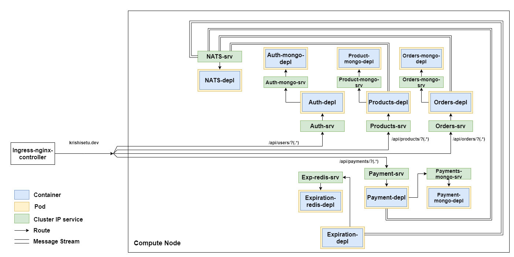

### Krishisetu

Krishisetu is a simple application build on the idea of loosely coupled micro-services which uses NATS Streaming as a message broker to communicate between different services.

##### Architecture

